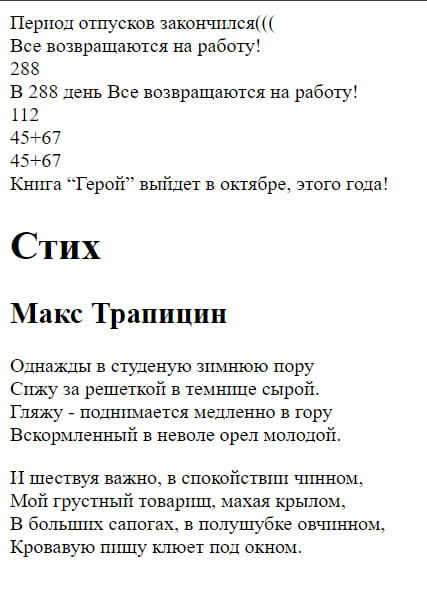

# PHP_1
1.[Описание](#1-описание).

2.[Задания и их реализация](#2-задания-и-их-реализация).

2.[Скриншот](#скриншот).

## 1.Описание
Код  программы написан на  PHP и содержит набор инструкций для вывода текста и выполнения простых арифметических операций. 
## 2.Задания
1. Выведите на экран „Период отпусков закончился!” используя echo и print.
```php
echo "Период отпусков закончился(((<br />" ;
```
2. Не забывайте – каждый оператор заканчивается на ;
3. Определите 2 переменные PHP: одна целочисленное со значением 288 и одна строчного типа – ”Все возвращаются на работу!”.
```php
$x=288;
$y="Все возвращаются на работу!<br>";
```
4. Выведите эти 2 значения на экран, каждую с новой строки.
```php
print($y);
print($x);
```
5. Потом выведите на экран строку, состоящую из значения первой переменной в конкатенации со второй, и дополнительного текста, так что бы вывести следующий текст ”В 288 день, приблизительно ... Все возвращаются на работу!”.
```php
$concat= "<br /> В {$x}  день ". $y;
echo($concat); 
```
6. Выведите на экран, используя echo, сумму чисел 45+67, используя следующий синтаксис: echo 45+67. Потом попробуйте вывести результат так echo „45+67” и echo ‚45+67’. Пронаблюдайте разницу в выводах.
```php
echo 45+67;
echo "<br />45+67";
echo '<br /> 45+67';
```
7. Выведите на экран следующее предложение Книга “Герой” выйдет в октябре, этого года! Используйте правильно кавычки!
```php
echo "<br /> Книга “Герой” выйдет в октябре, этого года!";
```
8. Добавьте стих и выведите его правильно.
```php
echo'
<H1>Стих</H1>
<H2>Макс Трапицин</H2>
<P>Однажды в студеную зимнюю пору<BR>
Сижу за решеткой в темнице сырой.<BR>
Гляжу - поднимается медленно в гору<BR>
Вскормленный в неволе орел молодой.</P>
<P>И шествуя важно, в спокойствии чинном,<BR>
Мой грустный товарищ, махая крылом,<BR>
В больших сапогах, в полушубке овчинном,<BR>
Кровавую пищу клюет под окном.</P>';
```
## Скриншот

